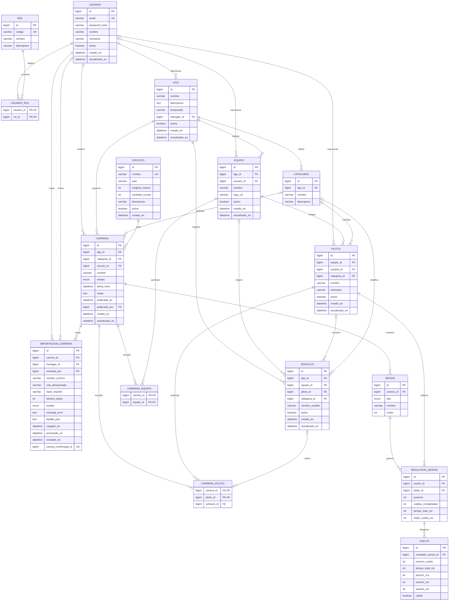

# RaceManager — Esquema de Base de Datos

**Motor:** MySQL 8.x  
**Script:** [`database/schema.sql`](../../database/schema.sql)  
**Versión:** 2 (2da entrega) — importación sin duplicados y publicación auditada

## Cómo aplicarlo

```bash
mysql -u root -p < database/schema.sql
```

O desde MySQL Workbench: abrir y ejecutar `database/schema.sql`.

Para una base creada con la versión 1: `database/migraciones/002_importacion_y_publicacion.sql`.
Datos de ejemplo para desarrollo: `database/datos-desarrollo.sql`.

## Diagrama entidad-relación



`o|` indica una referencia opcional (FK nullable); `||` indica una referencia obligatoria.
En las tablas puente, la clave primaria compuesta evita repetir la misma asociación.

## Entidades y relaciones

| Entidad | Propósito y relaciones |
|---|---|
| `usuario` | Cuenta del sistema. Puede tener varios roles, administrar ligas y quedar asociada opcionalmente a equipos o pilotos. También registra quién publicó una carrera, cargó una importación o la revisó. |
| `rol` | Catálogo de roles `ADMIN`, `MANAGER`, `EQUIPO` y `PILOTO`; se asigna a usuarios mediante `usuario_rol`. |
| `usuario_rol` | Asociación muchos-a-muchos entre usuarios y roles. PK compuesta: `(usuario_id, rol_id)`. |
| `liga` | Competencia administrada por un usuario; agrupa categorías, equipos, vehículos y carreras. |
| `categoria` | Pertenece a una liga; puede clasificar pilotos y vehículos y delimitar una carrera. |
| `equipo` | Pertenece a una liga, puede tener una cuenta de usuario asociada y agrupa pilotos. Puede inscribirse en carreras mediante `carrera_equipo`. |
| `piloto` | Pertenece obligatoriamente a un equipo; puede tener usuario y categoría asociados. Participa en carreras y sesiones. |
| `vehiculo` | Pertenece a una liga; su equipo, piloto y categoría son opcionales. Puede asignarse al piloto de una inscripción de carrera. |
| `circuito` | Catálogo de circuitos; una carrera requiere exactamente un circuito. |
| `carrera` | Pertenece a una liga y circuito; la categoría y quien publica son opcionales. Contiene sesiones, inscripciones e importaciones. |
| `carrera_equipo` | Asociación muchos-a-muchos entre carreras y equipos. PK compuesta: `(carrera_id, equipo_id)`. |
| `carrera_piloto` | Asociación muchos-a-muchos entre carreras y pilotos; puede indicar el vehículo utilizado. PK compuesta: `(carrera_id, piloto_id)`. |
| `sesion` | Pertenece a una carrera; contiene resultados de pilotos. El orden es único dentro de cada carrera. |
| `resultado_sesion` | Resultado de un piloto en una sesión; no puede haber más de un resultado por piloto y sesión. |
| `vuelta` | Desglose de tiempos de un resultado; el número de vuelta es único dentro de ese resultado. |
| `importacion_carrera` | Auditoría del archivo y del flujo de revisión de resultados. Pertenece a una carrera y registra al manager que carga y, opcionalmente, al usuario revisor. |

### Cardinalidades y restricciones de relación

- Una liga tiene un manager obligatorio; un usuario puede administrar cero o varias ligas.
- Cada equipo pertenece a una liga y cada piloto a un equipo. Una cuenta de usuario asociada a un equipo o piloto es opcional.
- Una carrera pertenece a una liga y a un circuito; su categoría es opcional. Cada sesión e importación pertenece a una carrera.
- Equipos y carreras, y pilotos y carreras, se relacionan muchos-a-muchos por sus respectivas tablas de inscripción.
- La asignación de vehículo a una inscripción, y las asociaciones de vehículo con equipo, piloto y categoría, son opcionales.
- Cada resultado corresponde a una sesión y un piloto; cada vuelta corresponde a un único resultado.
- `publicada_por` y `revisado_por` son relaciones opcionales con `usuario`. `manager_id` en `importacion_carrera` es obligatorio.
- Las claves foráneas garantizan existencia, pero no validan por sí solas que la liga/categoría/equipo/vehículo asociado coincida con la liga y los participantes de una carrera. Esa consistencia se valida en la aplicación.

## Estados de carrera

`PROGRAMADA` → `CARGADA` → `PUBLICADA` (o `CANCELADA`)

- `CARGADA`: hay resultados importados y confirmados, visibles solo para el Manager de la liga.
- `PUBLICADA`: visible para equipos y pilotos. La base exige registrar `publicada_en` y
  `publicada_por` (restricción `ck_carrera_publicacion`), de modo que toda publicación queda auditada.

## Estados de importación

`PENDIENTE` → `PROCESADA` → `CONFIRMADA` | `RECHAZADA` (o `ERROR` si el archivo es inválido)

| Regla | Cómo se garantiza |
|---|---|
| El mismo archivo no se carga dos veces para la misma carrera | `UNIQUE (carrera_id, hash_sha256)` |
| Una carrera tiene como máximo una importación confirmada | Columna calculada `carrera_confirmada_id` + `UNIQUE` |
| Solo se publica lo revisado | La aplicación publica únicamente carreras con una importación `CONFIRMADA` |
| Nada queda a medias | La importación y la escritura de resultados se hacen en una sola transacción |

Para corregir resultados ya confirmados se rechaza la importación vigente y se carga una nueva
(la carrera vuelve a `CARGADA` si estaba publicada). El mismo archivo en **otra** carrera se
detecta en la aplicación comparando `hash_sha256` y se informa como advertencia.

## Decisiones pendientes del modelo

- **Piloto sin equipo o con cambio de equipo entre temporadas:** hoy `piloto.equipo_id` es obligatorio.
  Definir con el equipo antes de mapear la entidad JPA.
- **Correspondencia con archivos reales:** no ampliar `sesion`, `resultado_sesion` ni `vuelta`
  hasta analizar muestras reales de Assetto Corsa (ver `docs/importacion/relevamiento-archivos.md`).
