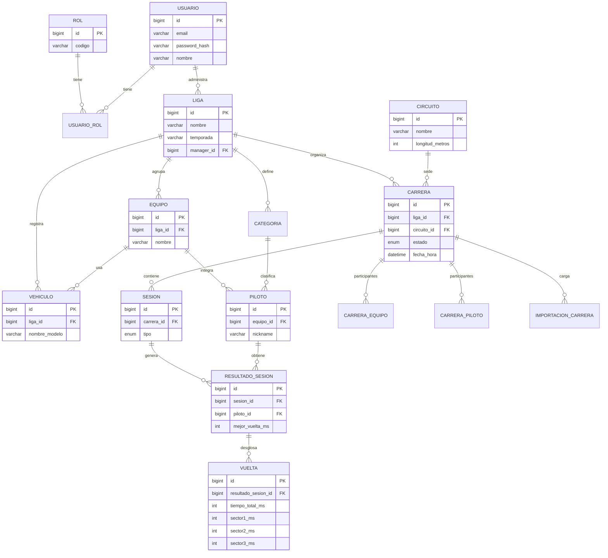

# RaceManager — Esquema de Base de Datos

**Motor:** MySQL 8.x  
**Script:** [`database/schema.sql`](../../database/schema.sql)  
**Versión:** 2 (2da entrega) — importación sin duplicados y publicación auditada

## Cómo aplicarlo

```bash
mysql -u root -p < database/schema.sql
```

O desde MySQL Workbench: abrir y ejecutar `database/schema.sql`.

Para una base creada con la versión 1: `database/migraciones/002_importacion_y_publicacion.sql`.
Datos de ejemplo para desarrollo: `database/datos-desarrollo.sql`.

## Diagrama entidad-relación (conceptual)



## Tablas principales

| Tabla | Propósito |
|---|---|
| `rol` / `usuario` / `usuario_rol` | Identidad y roles (ADMIN, MANAGER, EQUIPO, PILOTO) |
| `liga` / `categoria` | Competencias y categorías internas |
| `equipo` / `piloto` / `vehiculo` | Planteles y autos |
| `circuito` | Catálogo de pistas |
| `carrera` | Calendario y estados de publicación |
| `carrera_equipo` / `carrera_piloto` | Participantes |
| `sesion` / `resultado_sesion` / `vuelta` | Resultados y tiempos |
| `importacion_carrera` | Auditoría de archivos Assetto Corsa |

## Estados de carrera

`PROGRAMADA` → `CARGADA` → `PUBLICADA` (o `CANCELADA`)

- `CARGADA`: hay resultados importados y confirmados, visibles solo para el Manager de la liga.
- `PUBLICADA`: visible para equipos y pilotos. La base exige registrar `publicada_en` y
  `publicada_por` (restricción `ck_carrera_publicacion`), de modo que toda publicación queda auditada.

## Estados de importación

`PENDIENTE` → `PROCESADA` → `CONFIRMADA` | `RECHAZADA` (o `ERROR` si el archivo es inválido)

| Regla | Cómo se garantiza |
|---|---|
| El mismo archivo no se carga dos veces para la misma carrera | `UNIQUE (carrera_id, hash_sha256)` |
| Una carrera tiene como máximo una importación confirmada | Columna calculada `carrera_confirmada_id` + `UNIQUE` |
| Solo se publica lo revisado | La aplicación publica únicamente carreras con una importación `CONFIRMADA` |
| Nada queda a medias | La importación y la escritura de resultados se hacen en una sola transacción |

Para corregir resultados ya confirmados se rechaza la importación vigente y se carga una nueva
(la carrera vuelve a `CARGADA` si estaba publicada). El mismo archivo en **otra** carrera se
detecta en la aplicación comparando `hash_sha256` y se informa como advertencia.

## Decisiones pendientes del modelo

- **Piloto sin equipo o con cambio de equipo entre temporadas:** hoy `piloto.equipo_id` es obligatorio.
  Definir con el equipo antes de mapear la entidad JPA.
- **Correspondencia con archivos reales:** no ampliar `sesion`, `resultado_sesion` ni `vuelta`
  hasta analizar muestras reales de Assetto Corsa (ver `docs/importacion/relevamiento-archivos.md`).
